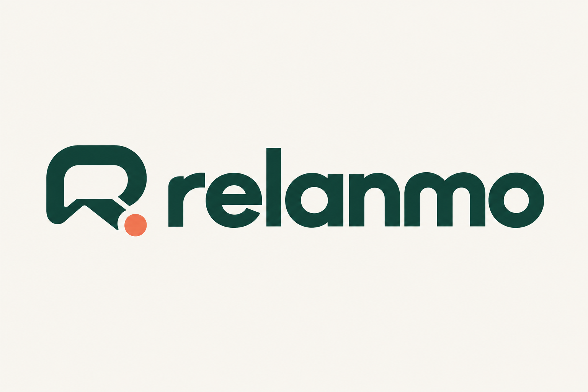

<p align="center">
  
</p>

# Relanmo

**La prospection avance. Vous aussi.**

Relanmo is an autonomous prospecting app for freelancers, starting with the French market. Customers connect LinkedIn, configure their offer, audience and writing style, then activate a bounded outreach sequence. Relanmo stops automated outreach on the first incoming message; a human takes over.

This repository contains the implementation specification, brand assets and **95 scoped Firstmate task briefs**. It is ready for development; the application is not implemented or deployed yet.

## Start with Firstmate

Register this repository as **relanmo** in Firstmate, then use the [captain handoff prompt](planning/prospecting-system/crew/captain-prompt.md). The planning pack is already in the expected directory; preserve it and the initial Git history during scaffolding.

1. Read [AGENTS.md](AGENTS.md), the [architecture](planning/prospecting-system/architecture.md), [brand guide](planning/prospecting-system/brand/README.md), and [shared contracts](planning/prospecting-system/crew/contracts.md).
2. Follow the [task index](planning/prospecting-system/crew/task-index.md): start P001, then P002/P003, parallelize the contract tasks, and integrate dependencies/exports with P007.
3. Continue with ready tasks using one isolated worktree and small PR per crewmate. Start with three implementation crewmates and one independent reviewer; merge one accepted PR at a time.

Crewmate profile: **Codex CLI · `gpt-5.6-luna` · `max` reasoning · Fast mode**. The repository includes project-level Codex defaults; Firstmate's local dispatch configuration is set separately using the [operating guide](planning/prospecting-system/crew/README.md). Verify the actual child session's model and `/fast status`. No agents have been launched by this seed commit.

```sh
python3 planning/prospecting-system/crew/check-plan.py --ready
```

The checker is read-only. The JSON manifest supplements Firstmate's native backlog/brief workflow; it is not a native Firstmate import file.

## Agreed stack

next-forge monorepo, Neon PostgreSQL, Better Auth, Drizzle, Stripe, Ultracite + Biome, Bun package management, Node.js 24 production runtimes, and Fumadocs in `apps/docs`. Temporal coordinates durable work, Unipile provides the LinkedIn connector, TypeSafe handles structured decisions, and Claude writes French messages. R2 uses AWS SDK v3 at runtime and Wrangler for setup. Render hosts the services.

Before adding dependencies, consult next-forge's live `llms.txt`. Discuss additions outside its documented choices and the agreed stack with the owner first. See [dependency policy](planning/prospecting-system/dependency-policy.md).

## Repository contents

| Path | Contents |
| --- | --- |
| `AGENTS.md` | Coding, dependency, safety and ownership requirements |
| `.codex/config.toml` | Requested project-level model/reasoning/Fast defaults |
| `FIRSTMATE.md` | Concrete repository intake and initial dispatch instructions |
| `planning/prospecting-system/` | Architecture, 30 tool guides, costs and implementation plan |
| `planning/prospecting-system/crew/` | 95 task cards, contracts, review process and readiness checker |
| `planning/prospecting-system/brand/` | Logo, app icon, palette, brand guide and preview |

For offline browsing, open [the handbook](planning/prospecting-system/handbook.html), [task board](planning/prospecting-system/crew/board.html), or [brand preview](planning/prospecting-system/brand/preview.html) from a local clone. GitHub displays HTML source rather than serving these as a website.

## Delivery boundaries

Keep sending, reply ingestion and uncertain-outcome recovery separate. Any incoming message—including attachment-only—must stop automation before model classification. Unknown send outcomes require reconciliation rather than blind retries. Humans handle responses.

This seed does not configure vendor credentials, purchase services, deploy a site, send prospecting messages or migrate customers. Live integration/pilot tasks have explicit external gates. Developer labor is budgeted at €0; [operating costs](planning/prospecting-system/cost-estimate.md) and development-agent usage are separate.
