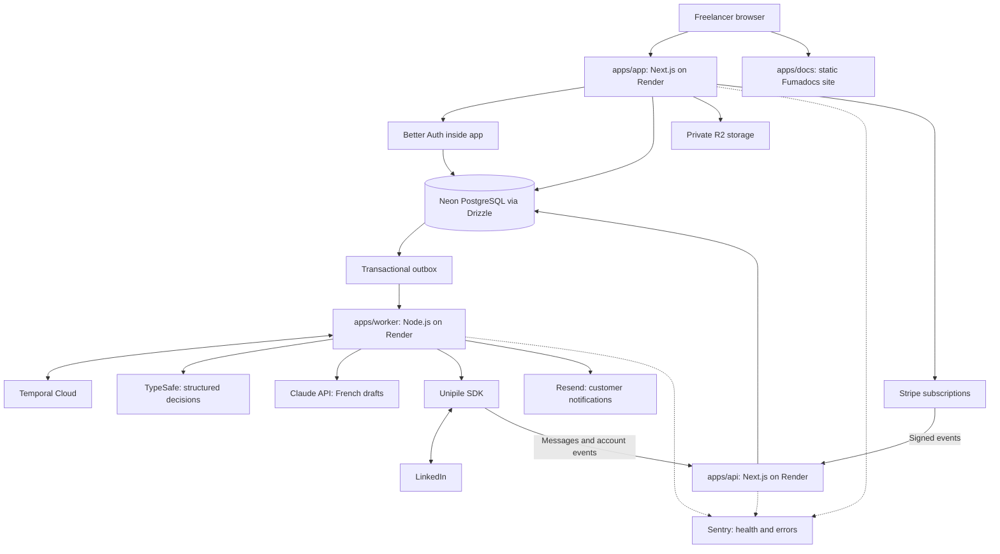
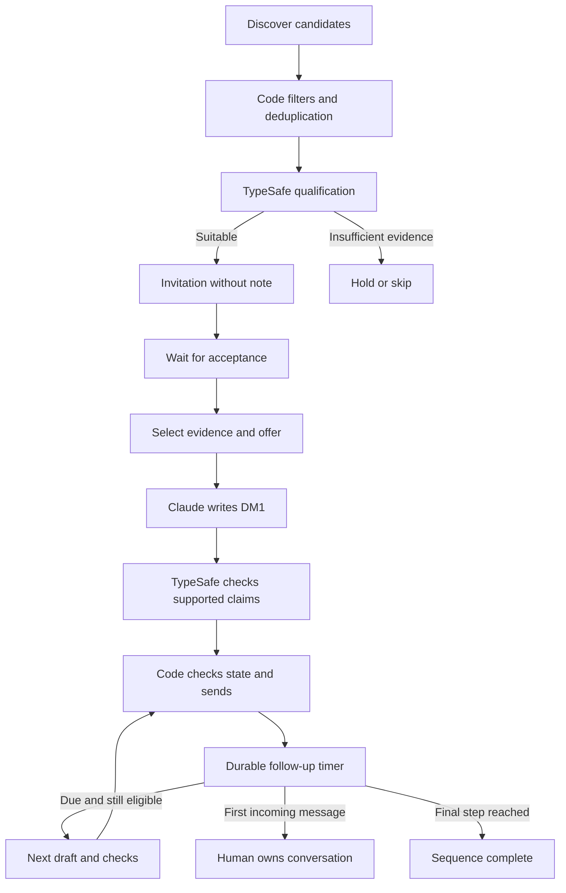
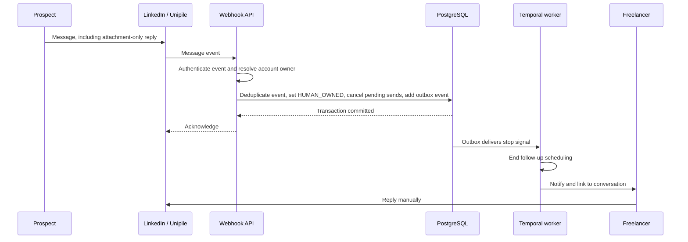

# Architecture with Unipile

**Proposed design, updated 17 September 2026.** Read alongside the [tool index](README.md) and [cost model](cost-estimate.md).

## 1. Components and ownership

Use a next-forge monorepository with `apps/app` (customer product and Better Auth), `apps/web` (static marketing), `apps/api` (webhooks/public API), `apps/docs` (Fumadocs product documentation) and `apps/worker` (Temporal). Share domain rules, Drizzle schemas and official TypeScript SDK adapters. Each customer has isolated records and independently controlled LinkedIn accounts; application servers are shared.

Bun installs the monorepository and runs the `apps/app` and `apps/api` Next.js processes; Node.js 24 LTS runs the deployed Temporal worker. Render runs those application processes; Temporal persists orchestration history; Neon persists business and authentication state. Temporal Cloud does not host our workers. [Temporal SDK runtime requirements](https://github.com/temporalio/sdk-typescript#requirements), [Next.js deployment options](https://nextjs.org/docs/app/getting-started/deploying).

Choose Frankfurt for Render and a nearby supported EU Neon region, with an EU Temporal namespace where available. Use TLS and bounded pools between providers; sharing a city name does not imply a shared private network. R2 uses an explicit EU jurisdiction for private files. Better Auth is self-hosted in the application and accesses Neon through Drizzle. [Neon connection guidance](https://neon.com/docs/connect/choose-connection), [Better Auth adapter](https://better-auth.com/docs/adapters/drizzle), [R2 location controls](https://developers.cloudflare.com/r2/reference/data-location/).

Keep Better Auth routes and customer commands on the customer app origin. `apps/api` authenticates provider events and does not need to receive browser session cookies. The marketing app can remain a static export. See the [monorepo guide](tools/next-forge.md) and [SDK policy](sdk-policy.md) for package boundaries.

## 2. Customer activation

1. The freelancer signs into our application through Better Auth. A verified server session and current tenant membership authorize customer commands. Stripe supplies the subscription entitlement; checkout redirects alone cannot grant paid access.
2. They describe their offer, skills, availability, geography, day rate, exclusions and preferred French tone. Defaults automatically adapt to those facts. Optional writing samples improve style matching, and editable preferences/templates remain authoritative. Provide previews without introducing per-message approval. See [prompt personalization](prompt-personalization.md).
3. The backend generates a short-lived Unipile Hosted Auth link. Bind it to a one-time connection attempt belonging to this customer.
4. The freelancer completes LinkedIn authentication and any required challenge in that hosted flow. Use the hosted credentials path for the initial design; do not make an extension mandatory.
5. The backend verifies the resulting account and attaches its provider ID to the correct tenant. A browser success redirect alone is not proof of account ownership.
6. Import existing prospects and bootstrap relevant conversation history. Any previously replied-to or manually handled conversation starts in human ownership.
7. Show campaign scope, cadence, working hours and quotas. Activation authorizes the bounded automated sequence in the product; it does not require approving each individual draft.

Hosted Auth documents connection/reconnection flows and a callback correlation field. Exact callback security and account-binding behaviour must be exercised in the integration spike. [Unipile Hosted Auth](https://developer.unipile.com/docs/hosted-auth).

## 3. Prospect lifecycle

Use LinkedIn search through Unipile for the first version. Classic, Sales Navigator and Recruiter capabilities depend on the customer's account. A platform API subscription does not supply a customer's LinkedIn premium subscription. [Unipile search documentation](https://developer.unipile.com/docs/linkedin-search).

Preserve the existing skill's default invitation-without-note pattern and DM1–DM5 cadence: DM1 after confirmed acceptance; subsequent target dates at DM1 +2, +5, +9 and +14 days. Also preserve minimum gaps from the previous actual send. Move due actions into the next permitted business window. Late processing must not compress several messages into one catch-up burst. At DM1 +21 days, or at least seven days after a delayed DM5, a still-silent lead can close as no response.

This cadence is extracted from the existing [DM skill at the reviewed repository snapshot](https://github.com/maximebrmd/lead-agent-skills/blob/f5060aac8dbf5550905d3c85f6099712d9f4cd8c/skills/dm/SKILL.md). It is a configurable product default, not a statement about LinkedIn's allowed sending volume.

## 4. First-reply handover

Unipile's message event also contains outgoing messages. Normalize direction by sender identity. A confirmed bot send must match our send ledger; an unmatched owner send triggers takeover after a short reconciliation period to distinguish a fast bot echo from manual activity. A reaction or read receipt is not itself an incoming message. [Unipile message events](https://developer.unipile.com/docs/new-messages-webhook).

The database stop is authoritative even if Temporal is temporarily unavailable. Apply it to both the conversation and its account/prospect pair, so a second campaign cannot restart automation. A transactional outbox retries delivery of the stop signal and customer notification. Future send attempts must read the current database state; a stale timer or draft cannot override human ownership.

**Precise guarantee:** after the incoming event is durably recorded, no new action for that account/prospect may be authorized into `IN_FLIGHT`. An action already authorized for dispatch can still complete. There is also a race if a reply reaches LinkedIn before its event reaches us. A final conversation refresh and state check reduce that window; they cannot create an atomic transaction across LinkedIn and our database. Measure and report late-event incidents rather than promising impossible zero-race delivery.

## 5. Reliable outbound actions

Every invitation and message receives an immutable local `action_id`, unique for tenant, account, prospect, campaign and step. The action stores exact text, evidence IDs, campaign version and a lifecycle of `READY`, `IN_FLIGHT`, `CONFIRMED`, `FAILED` or `UNKNOWN`.

Before dispatch, verify current account health, campaign activation, recipient eligibility, send window, quota reservation, human ownership and the latest known incoming activity. Serialize outbound activity per account with a database-backed lease and fencing version; a process-local mutex is insufficient across replicas.

An expired lease or HTTP timeout during a send becomes `UNKNOWN`. Reconcile conversation history and provider message IDs before doing anything else. If the outcome cannot be determined, pause that action for investigation. Never treat an internal idempotency key as proof that the external API deduplicates sends.

A clean receipt records the provider message ID and confirms the ledger. A retry of the same workflow then observes completion rather than issuing another message. Build automatic retries around reads and verified transient failures; side-effecting calls need this explicit reconciliation path.

## 6. Database and workflow boundaries

| Business record | Important contents |
| --- | --- |
| Better Auth auth tables | Users, sessions, login identities and verification records, isolated from LinkedIn provider accounts |
| `billing_customers`, `subscriptions`, `billing_events` | Stripe mappings, verified billing state and deduplicated billing events |
| `tenants`, `memberships`, `freelancer_profiles` | Customer access, offers, preferences and tenant ownership |
| `style_profiles`, style/override versions | Customer writing preferences, examples, editable templates and version provenance |
| `provider_accounts` | Unipile ID, LinkedIn identity, status, capability snapshot, last successful reconciliation |
| `campaigns`, `campaign_versions` | ICP, exclusions, hours, quotas, step templates and activation history |
| `prospects`, `evidence` | Provider identifiers, relevant facts, source URL, observed time and content hash |
| `conversations`, `messages` | Direction, message ID, human ownership and reply timestamps |
| `actions`, `send_attempts` | Exact outbound body, unique step key, uncertain outcomes and provider receipts |
| `webhook_events`, `outbox_events` | Deduplicated input events and durable internal event delivery |
| `usage_events`, `audit_events` | Tokens, model/version, cost, state changes and operator actions |
| `suppression_entries` | Customer-specific exclusions, objections and do-not-contact decisions |

Keep profile text, evidence and drafts in Postgres or private storage. Pass record IDs and small decision summaries through Temporal. This limits history costs and reduces copies of personal data. Use one workflow per prospect sequence, batched discovery workflows, and separate account reconciliation schedules. Long-running account workflows require bounded history or Continue-As-New.

## 7. Data and operations

Enable tenant isolation at every API and database boundary. Store Unipile, TypeSafe, Claude, Temporal and Resend credentials only in server-side secret configuration. Use separate production/staging keys and synthetic staging data. Do not send entire LinkedIn inboxes to models; only the minimum approved context needed for the current decision.

Configure seven-day Neon restore history from the pilot and retain encrypted logical exports in private R2 storage. A database restore must leave all campaigns paused until provider history and action ledgers are reconciled: restoring old state must not resend old messages. Review restored authentication sessions too. Database restoration does not roll back R2 objects; preserve recoverable file copies or a documented re-import path. [Neon restore behaviour](https://neon.com/docs/postgres/backup-restore/branch-restore).

Monitor webhook lag, account disconnections, unknown sends, queue age, stale account reconciliations, model errors and per-customer cost. On uncertainty, pause affected outgoing work while continuing to ingest replies. The person responsible for operations receives alerts; 24/7 software operation still requires someone available for incidents.

## 8. Required engineering decisions

Neon, Better Auth, Drizzle, next-forge, Stripe, Ultracite with Oxlint and Oxfmt plus its vendored anti-slop preset, Bun as package manager, and official TypeScript SDKs are fixed requirements. Supabase, Clerk and Prisma are replaced in the proposed build. No extra managed authentication service is needed. Production auth, payment and database configuration must be explicit, including package-specific environment validation.

Stripe entitlements determine whether new outreach may start. A payment problem pauses outgoing activity according to the product grace policy while reply ingestion and unknown-send reconciliation continue. Our `packages/payments` module is the sole owner of subscription state.

## 9. Documentation and dependency governance

The public Fumadocs app contains product help; tenant data, private prompts and operator runbooks stay outside its static content and search index. R2 setup uses Wrangler while runtime operations use the AWS S3 v3 SDK. Consult next-forge before new dependency choices and discuss additions outside its documented catalog and the agreed stack with the user. See the [dependency policy](dependency-policy.md) and [implementation instructions](AGENTS.md).
