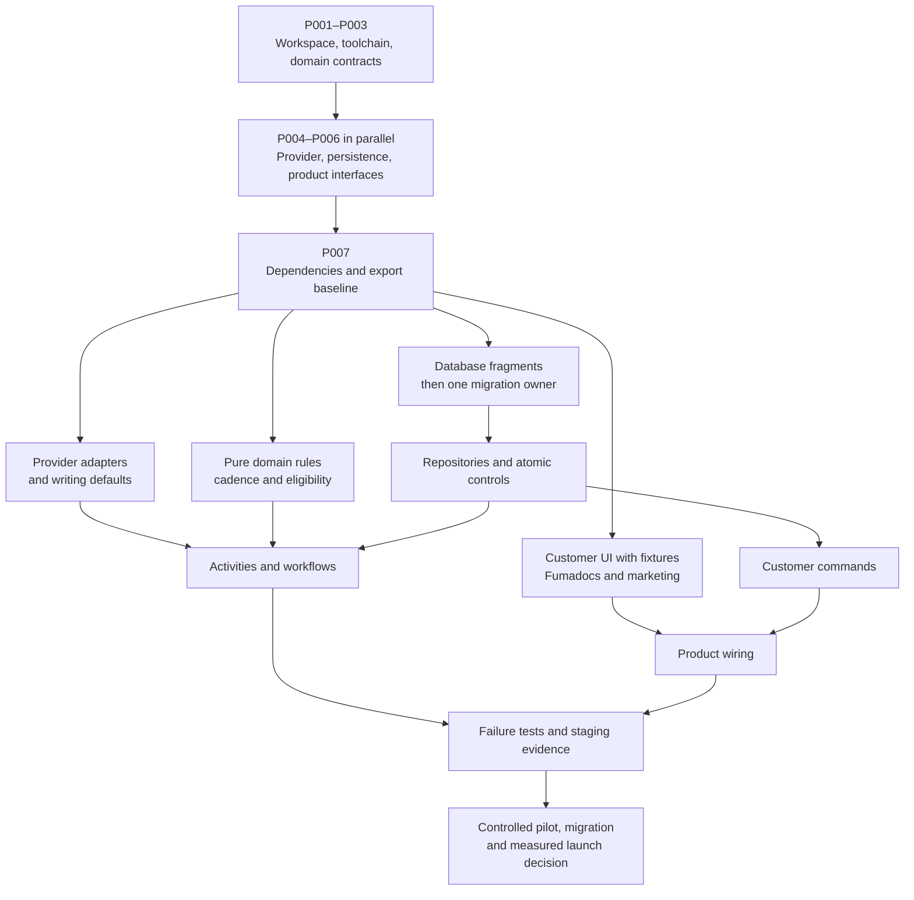
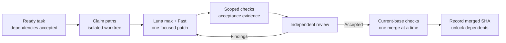

# Parallel implementation with Firstmate

**95 small tasks, each with its own Markdown brief, dependencies, writable paths and acceptance evidence.** The recommended starting fleet is three Luna/max/Fast implementation crewmates and one independent reviewer. Keep one merge at a time. The Relanmo repository contains planning and branding; the application is still a specification and these tasks have not been run.

Open the [searchable task board](crew/board.html), [full task index](crew/task-index.md), or [prompt to give Firstmate](crew/captain-prompt.md). The [operating guide](crew/README.md) includes configuration examples, native brief/dispatch mechanics and the read-only dependency checker.

## How independence works

The first tasks establish the monorepo and shared interfaces. After those merge, crewmates implement separate directories against the agreed contracts. UI tasks use fixture data and injected interfaces while backend work proceeds. Small integration tasks connect the finished pieces. Shared files have one owner: `bun.lock`, manifests, global configuration, package exports and migration journals are never edited concurrently.

This is a summary graph. [tasks.json](crew/tasks.json) contains the precise dependencies; tasks inside a displayed lane can still have prerequisites. Independent code paths do not eliminate the need for shared contract decisions or integrated tests.

## First dispatches

| When | Ready work | Acceptance before advancing |
| --- | --- | --- |
| Repository/Firstmate preflight complete | P001 workspace baseline | Reviewed clean scaffold; no conflicting default providers |
| P001 merged | P002 toolchain | Reproducible Bun/Node, lint and typecheck commands |
| P002 merged | P003 domain contracts | Agreed IDs, versions, messages, action states and Workflow interfaces |
| P003 merged | P004 provider ports, P005 persistence ports, P006 product DTOs | Three separate directories, reviewed compatible interfaces |
| P004/P005/P006 merged | P007 dependencies/exports | One lockfile and tested import surface |
| P007 merged | Many independent choices | Domain rules, schema fragments, adapters, UI fixtures, Fumadocs, marketing, CI, R2 setup and migration parsing can enter the queue |

After P007, a useful first three-crewmate batch is P013 database transactions, P033 Unipile accounts and P037 TypeSafe adapter, while the reviewer finishes accepting each. Keep replacing finished work with ready tasks; do not wait for an entire artificial wave. Prioritize the remaining Unipile adapters and P089 live capability report when controlled credentials are available.

## Size and review boundaries

Each card aims for one behavior and usually 150–400 changed logical lines, excluding generated scaffolding/SQL. A task that grows beyond one coherent review should be split before widening its ownership. The 95-card count is a starting decomposition, not a fixed quota or a promise that every task is equal effort.

| Area | Review units | Examples |
| --- | ---: | --- |
| Foundation/contracts | 8 | Toolchain, provider ports, persistence ports, CI |
| Domain rules | 4 | Eligibility, DST-aware cadence, identity, draft checks |
| Database schema/security | 9 | Independent schema fragments, single migration lineage, RLS |
| Repositories | 11 | Action ledger, leases/quotas, atomic reply stop |
| Provider adapters | 10 | Separate Unipile operations, TypeSafe, Claude, Stripe, R2 |
| Writing and authentication | 5 | Defaults, composition, optional style inference, Better Auth |
| Customer product | 16 | Separate screen and server-command tasks |
| Automation and final product wiring | 14 | Authorization, dispatch, reconciliation, workflows, binding |
| Public docs and marketing | 3 | Fumadocs foundation, French help, marketing |
| Operations and migration | 8 | Images, release pipeline, Wrangler, import/cutover |
| Release evidence | 7 | Race/crash tests, tenancy, French eval, browser journey, pilot |

A ship task creates one PR; a scout produces one evidence report. A dependent task starts from the **merged reviewed result**, not another agent's unfinished branch. Review and merge serialization keep independent worktrees from turning into a large final merge exercise.

## Review loop

For reply stopping, uncertain sends, tenant isolation, billing and migrations, review must examine actual behavior under faults. A unit-test double cannot prove PostgreSQL locking works. For screens/docs, check rendered states and links. The [review checklist](crew/review-checklist.md) explains the evidence expected at each boundary.

## Firstmate and model configuration

Use `gpt-5.6-luna`, effort `max`, in the [Firstmate dispatch example](crew/crew-dispatch.example.json). Configure Fast separately through [Codex project settings](crew/codex-project.example.toml), then inspect the actual child session. Firstmate currently supports Codex through its CLI adapter; `codex-app` is not a supported backend. The [operating guide and sources](crew/README.md) record the verified revision and setup details.

Our JSON backlog and checker are supplementary planning tools. They do not replace Firstmate's native brief/status/backlog lifecycle or automatically launch agents. The current technical pack already captures the next-forge dependency discussion rule and remains the source of product decisions.

Live credentials, controlled provider recipients and pilot authorization are recorded as **external gates**, limited to the tasks that need them. Most development proceeds with fixtures and isolated test services. Developer labor remains €0; development-agent credits/API usage are a separate cost from the monthly SaaS hosting estimate.
