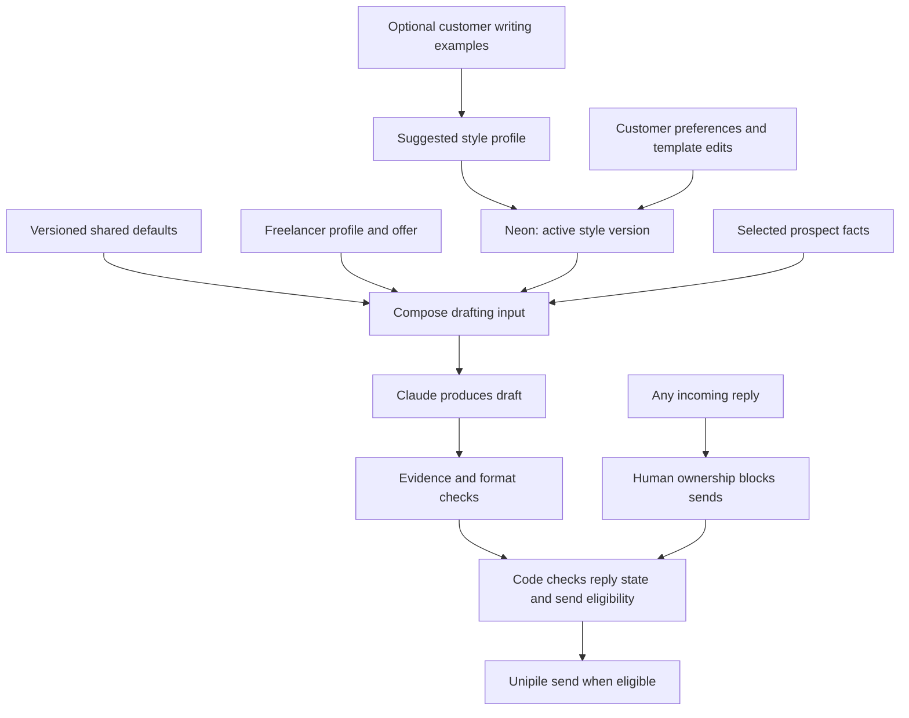

# Default prompts and customer writing style

**Design clarification, 17 September 2026.** Use a hybrid approach: everyone starts with tested defaults, messages adapt to their freelancer profile and offer automatically, and customers can edit the writing settings or supply examples. Using the product should not require learning prompt engineering.

## What `packages/prompts` means

It is our own workspace library, not a third-party dependency or a service to buy. It contains versioned default instructions, DM1–DM5 templates, allowed variables, prompt composition code and synthetic evaluation fixtures. Sharing it lets onboarding previews, campaign drafting and evaluations use the same logic.

It does **not** contain a folder of private prompts for each customer. Customer preferences and edits are tenant-scoped data in Neon. The UI presents these as “Writing style” and “Message templates”; customers need not understand monorepo package names.

| Layer | Where it lives | What changes it |
| --- | --- | --- |
| Shared defaults and composition rules | `packages/prompts`, versioned with releases | Product development and evaluation |
| Freelancer facts, offer and target market | Neon profile/campaign records | Onboarding imports and customer corrections |
| Customer writing preferences and examples | Neon style profile and immutable versions | Customer edits and accepted suggestions |
| Customer template or step overrides | Neon prompt-override versions | Customer editing, reset or campaign override |
| Prospect facts and evidence | Neon evidence records | Discovery and qualification |
| Exact generated draft and provenance | Draft/action records | A bounded generation attempt |

## Customer experience

1. Onboarding captures their offer, expertise, target audience and profile facts. Defaults immediately support a usable campaign.
2. Show simple controls: language, `vous`/`tu`, formality, directness, message length, phrases to avoid, signature and preferred call to action. Begin with concise professional French; preserve imported customer preferences when available.
3. Optionally accept a few examples written by the freelancer. A bounded Claude call proposes a structured style profile. Without examples, adapt the subject matter and terminology but do not claim to have learned their personal voice from a job title.
4. Display a few previews and allow edits or reset to defaults. This is onboarding configuration, not a requirement to approve every outgoing message. Campaign activation continues to authorize the bounded automated sequence.
5. Provide an advanced editor for additional writing instructions and DM-step templates. Explain available variables and show missing or invalid ones before saving. Customer overrides are never overwritten silently by inferred preferences.
6. Keep profile facts current when the customer updates their offer. Explicit writing preferences persist. Future learning from customer corrections can suggest a new style version; it must not silently replace an explicit preference or start replying to prospects automatically.

Example: “Freelance analytics engineer, helping French SaaS teams” supplies facts and vocabulary. “Use `vous`, short sentences, no emojis, and avoid ‘j'espère que vous allez bien’” supplies writing preferences. Neither permits inventing a client result or ignoring a prospect's reply.

## Composition and precedence

Apply campaign-specific explicit writing overrides ahead of customer-wide preferences, then accepted inferred style, then shared defaults. Factual grounding constrains every layer. Prospect claims, including shared connections and factual template overrides, must match typed assertions in tenant- and prospect-scoped allowed evidence. A step override may bypass evidence only after the application has persisted a certification that its exact text is neutral. Reply-stop, tenancy, permission, quota and send-state rules remain enforced in code regardless of prompt content.

Customer text is bounded data in the composer, not a replacement for application control instructions. Validate allowed variables, lengths and template syntax. Use plain structured interpolation; never evaluate customer JavaScript or compile their text as MDX. Prospect content and writing examples cannot instruct the application to call tools or change permissions.

## Data and versioning

Use application-owned tables such as `style_profiles`, `style_profile_versions`, `prompt_overrides` and `prompt_override_versions`. Names are proposed schema contracts. Every customer record has tenant ownership; record explicit versus inferred origin, author, timestamps and the active version. Existing campaign versions reference the relevant settings.

Each draft records the shared template, campaign, profile, style, override and model versions; allowed evidence IDs; the normalized drafting selection and prospect-context snapshot used for composition; and the exact text. This bounded provenance reconstructs the draft without copying the entire private profile into every workflow history.

Saving a new active style invalidates affected unsent drafts and marks them for regeneration before authorization. A generation that started against an older version must fail the version check before becoming send-eligible. Keep confirmed history unchanged; do not blindly regenerate and resend an `UNKNOWN` or `IN_FLIGHT` action. Preserve the action ID, current cadence and human ownership.

## Evaluation and cost

Test two customers with different tones, sparse profiles, conflicting campaign/customer preferences, reset to defaults, malicious example text, stale draft versions and a reply during regeneration. Evaluate factuality separately from stylistic similarity. A message sounding natural does not establish factual accuracy.

No new model provider, vector database, prompt-management service or fine-tuning job is required. The existing Claude/TypeSafe adapters perform the work. A proposed allowance of one style analysis per customer per month, with 4,000 input and 400 output tokens, costs $0.012 on the model's existing Sonnet rate before retry allowance. Preview drafts are included in the existing 400-draft budget; increasing their volume requires adjusting the cost model. [Cost inputs](cost-model.json).
