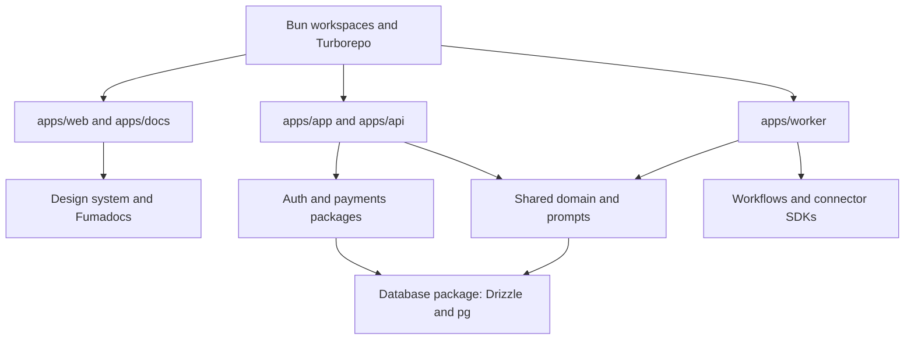

# next-forge — required monorepository foundation

Use next-forge as the starting repository, with Bun workspaces, Turborepo and its shared package conventions. Record the scaffold's upstream revision and pin tested dependencies. This document specifies a future build; no application has been scaffolded or deployed in this research task.

The published template uses Clerk for authentication and Prisma with Neon for data. Replace those integrations with Better Auth and Drizzle as requested. Keep the template's Stripe integration boundary. [Installation](https://www.next-forge.com/docs/setup/installation), [authentication](https://www.next-forge.com/docs/packages/authentication), [repository structure](https://www.next-forge.com/docs/structure).

## Target layout

```text
apps/
  app/                      Customer Next.js app, auth routes, commands
  web/                      Marketing site, static export for MVP
  api/                      Unipile and Stripe webhooks, public API
  docs/                     Fumadocs product documentation, static export
  worker/                   Added Node.js Temporal process
packages/
  auth/                     Better Auth server and client entry points
  database/                 Drizzle schemas, pg pools, SQL migrations
  payments/                 Stripe SDK, subscriptions, entitlements
  email/                    Resend SDK and React Email templates
  storage/                  AWS S3 v3 R2 adapter, provisioned via Wrangler
  observability/            Sentry and structured logging
  design-system/            Shared React UI
  domain/                   Ownership, cadence, quotas, send eligibility
  workflows/                Deterministic Temporal workflow definitions
  connectors/               Unipile, TypeSafe and Anthropic adapters
  prompts/                  Our shared defaults, composition and evaluations
  typescript-config/        Shared strict compiler settings
```

`apps/app` is the product; `apps/web` is marketing; `apps/docs` is the Fumadocs documentation app. Keep those next-forge names consistent. Preview email, Storybook and local schema tooling can remain developer tools without their own production services.



## Shared prompts and customer settings

`packages/prompts` is our own library, not a third-party dependency. It holds the tested defaults and the code that combines them with customer settings. Per-customer prompts, writing examples and style overrides live in Neon. Start with defaults that adapt to the freelancer's profile and offer; users can change tone, templates and instructions. Profile facts alone do not reveal someone's writing voice. See [prompt personalization](../prompt-personalization.md) for precedence, versioning and the customer experience.

## Dependency decisions

Before adding anything, consult [next-forge's llms.txt](https://www.next-forge.com/llms.txt), inspect existing packages, and follow the [dependency policy](../dependency-policy.md). Use relevant documented addons that simplify the product. Discuss anything outside that catalog and the agreed stack before adding it. `next-safe-action` is selected for repeated validated customer commands, and `nuqs` for pipeline URL filters; each has its own guide.

## Adaptation sequence

1. Initialize next-forge with Bun, commit `bun.lock`, and record the template revision. Inspect the generated version rather than assuming today's documentation exactly matches every file.
2. Replace `packages/database` implementation and all Prisma imports, generated-client paths, studio commands and migration scripts. Preserve a deliberate public API for database access.
3. Replace `packages/auth` and its callers, including providers nested inside design-system setup. Remove obsolete Clerk keys and callbacks.
4. Add the Temporal worker and workflow package. Its dependency graph must exclude React, Next.js request APIs and browser-only modules. Activities own network/database calls; workflow definitions remain deterministic.
5. Configure Stripe in `packages/payments` and signed webhooks in `apps/api`. Add application billing tables and entitlement transitions.
6. Configure Ultracite's Oxlint/Oxfmt providers and vendored anti-slop preset explicitly. Remove competing lint/format scripts left by the scaffold and make the chosen commands mandatory in CI.
7. Keep package-local environment schemas. Validate required runtime configuration per deployed app; a missing auth, database, Stripe or worker key must produce a clear startup failure for the service that requires it.
8. Add Fumadocs in `apps/docs` using the documented migration, then configure static export and browser search. Replace Mintlify scripts rather than requiring both documentation systems.
9. Provision private R2 buckets through Wrangler and use the AWS S3 v3 SDK at runtime.
10. Remove unused commercial integrations from the deployed surface and environment requirements. The template's availability of a CMS, notifications platform or hosted docs does not mean this product needs to buy them.

## Deployment and cost

Deploy app, API and worker as separate Render services, with separate staging equivalents. Marketing and Fumadocs docs use static exports on Render's static hosting tier. This is a chosen deployment layout, not a requirement to deploy every workspace. If either static app later requires dynamic rendering, add its compute cost. No paid next-forge or Turborepo cloud service is required.

## Acceptance

One fresh Bun install must build each app from the root. CI must find no active Prisma/Clerk/Supabase integration, all required providers must be validated, and generated code must use the shared packages instead of introducing parallel implementations.

Use the official next-forge [Better Auth migration](https://www.next-forge.com/docs/migrations/authentication/better-auth), [Drizzle migration](https://www.next-forge.com/docs/migrations/database/drizzle) and [Fumadocs migration](https://www.next-forge.com/docs/migrations/documentation/fumadocs) as integration starting points, then check the current libraries for version-specific APIs.
