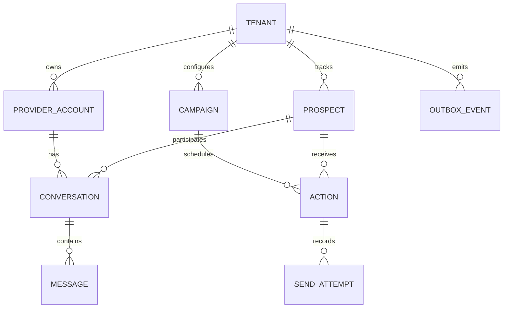

# PostgreSQL — authoritative product state

**Status: required database, hosted by Neon.** This is the same database billed in [neon.md](neon.md), not another subscription. Drizzle manages both product and Better Auth schemas.

## Schema and invariants

Use the records listed in the [architecture](../architecture.md). Every tenant-owned row has a tenant identifier, and references between tenant-owned records must preserve that ownership.

Enforce these constraints in the database as well as application code:

- A provider account ID maps to one authorized owner; reconnect cannot silently transfer it.
- A provider message/event identifier is unique in its account scope.
- An action step is unique for tenant, account, prospect, campaign version and step.
- At most one automated sequence is active for the same account/prospect pair.
- Human ownership and objections block new sequences as well as existing conversation timers. Re-enrolment requires an explicit valid product action.

## Transactions

For an inbound message, atomically deduplicate the event, store it, set conversation and account/prospect ownership, cancel pending actions and insert internal outbox events. Only then acknowledge the webhook.

For a send, atomically verify eligibility, reserve quota, and change the action to `IN_FLIGHT` under account-scoped coordination. Lock the same account/prospect ownership row in send authorization and reply-stop transactions. Do not hold a long database transaction open while waiting on an external API. An uncertain external outcome remains in the ledger until reconciled.

Outbox consumers can claim batches with appropriate row locking. All consumers must tolerate redelivery; a claimed outbox row is not proof an external action happened. Use database-enforced uniqueness and compare-and-set state changes rather than “check then insert” races.

## Isolation and access

Use least-privilege database roles, explicit tenant predicates and tested row-level security. Better Auth establishes application identity; it does not automatically populate a database tenant context. Set validated context transaction-locally on the same connection, and use runtime roles that do not own tables or bypass RLS. A migration credential is not an application credential. [PostgreSQL RLS documentation](https://www.postgresql.org/docs/current/ddl-rowsecurity.html).

Prefer indexed queries for due actions, account/prospect identity, unprocessed outbox records and recent conversation messages. Retain compact operational records and expire unnecessary raw payloads under the product's data policy.

## Restore and verification

Run real concurrency tests against Postgres, including two workers attempting the same step, a reply racing a send reservation, and duplicate webhook delivery. Test migrations against a representative sanitized import.

A restore runbook must pause all senders before database recovery and reconcile provider history afterwards. A restored `READY` row may represent a message already delivered in the real world.

## Cost

Compute, disk and restore history are covered by Neon. Workload dimensions are retained prospects/messages, payload size, indexes, write rate and connection count—not only registered users. A separate vector database is unnecessary for the initial bounded qualification design.
