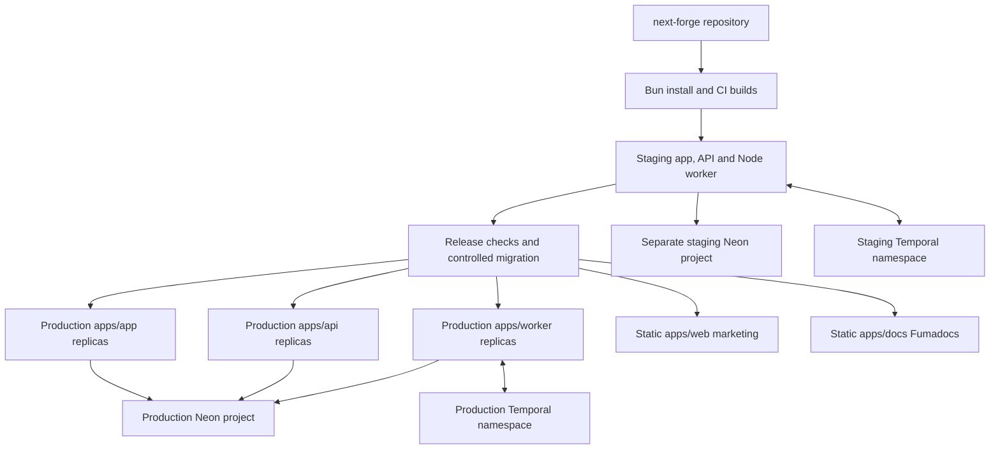

# Render — application and worker hosting

**Status: recommended host.** Use Frankfurt and paid dynamic services for the continuously operating product. [Regions](https://render.com/docs/regions), [background workers](https://render.com/docs/background-workers).

## Deployment layout

The customer application, provider API and worker have independent replicas. Better Auth runs inside the customer app; it needs no separate service. Unipile provides LinkedIn connections, so there is no per-customer browser container, proxy fleet or desktop VM.

## Setup

1. Define each service and environment in version-controlled Render configuration, rooted in the same next-forge repository. Choose Frankfurt and attach the appropriate domains.
2. Build dependencies with pinned Bun and the frozen lockfile. Deploy the customer app and API as separate Node web services, and the Temporal process as a Node background worker.
3. Export marketing and Fumadocs documentation statically for the MVP. Configure docs for static browser search and confirm all pages support export; if dynamic rendering is retained, add a paid service rather than pretending it is free static hosting.
4. Configure production and staging secrets separately. The API receives provider webhooks over TLS, authenticates events and commits database/outbox records before acknowledgement.
5. Configure health and graceful shutdown behaviour. Apply reviewed Drizzle migrations once per release, with the direct database URL and migration role. Runtime services use their restricted pooled connections.
6. Keep per-account leases, reply ownership and send coordination in Postgres so replicas cannot overlap. Container-local files and locks are insufficient.
7. Add alerts for queue age, webhook lag, memory pressure and missing worker heartbeats. Scale on measurements.

## Cost and capacity

The model includes the workspace, three dynamic service types, permanent staging and a separate bandwidth/CI allowance. Current Pro has a workspace fee separate from compute. [Workspace plans](https://render.com/docs/new-workspace-plans), [compute pricing](https://render.com/pricing).

Start with one $25 customer-app instance, one $25 API instance and one $25 worker. Add the $25 workspace, $7 staging app, $7 staging API and $25 staging worker: **$139/month** for Render in the ten-customer model. This is a planning size, not a benchmark. Static marketing and documentation usage is subject to hosting limits and overages. Fumadocs adds no always-on Node instance under this design.

Render-to-Neon traffic crosses providers. Use TLS and account for network usage. Same-region placement does not imply free private connectivity. The staging worker may remain deployed while its test schedules are disabled; its database should stay idle outside the 160 monthly compute hours assumed in the Neon model.

## Verification

Prove a restart preserves progress, a deployment cannot duplicate sends, staging cannot act on production LinkedIn accounts, and a database/provider outage is visible. Additional replicas improve process resilience without creating multi-region recovery. No Kubernetes, Redis or extra serverless platform is required for this initial design.
